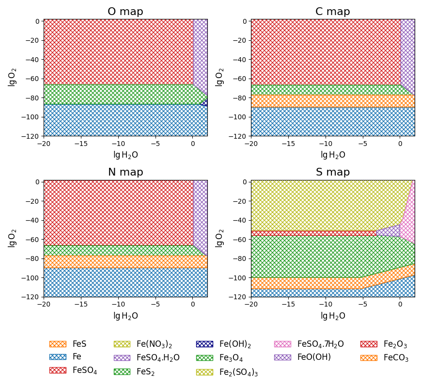

# corrosion_maps

A small Python library for creating and studying corrosion maps of steel in the context of scCO<sub>2</sub> streams.

## How to use as a library

```
#Import
from ccstoolkit import corrosion_maps

#Input
P = {
	'S': 0.5,		#[mol/m^3], [mM]	#Total amount of sulphur (H2S, SOx, ...)
	'N': 0.75,		#[mol/m^3], [mM]	#Total amount of nitrogen (NOx, HNOx, ...)
	'C': 2e3,		#[mol/m^3], [mM]	#Activity of CO2
	'T': 298.15		#[K]				#Temperature in  K
}

#Output
print(corrosion_maps.get_maps(P))
```
## How to use the cli

<ins>**Pr**</ins>int the map data

`python3 -m corrosion_maps.cli -p 0.5 0.75 2e3  298.15 -pr`

Show the <ins>**pl**</ins>ot

`python3 -m corrosion_maps.cli -p 0.5 0.75 2e3  298.15 -pl`

Save the <ins>**o**</ins>utput to file

`python3 -m corrosion_maps.cli -p 0.5 0.75 2e3  298.15 -o file_name`

<ins>**S**</ins>ave a pre-formated <ins>**p**</ins>lot to file

`python3 -m corrosion_maps.cli -p 0.5 0.75 2e3  298.15 -sp file_name`

## Example plot


## License

MIT

