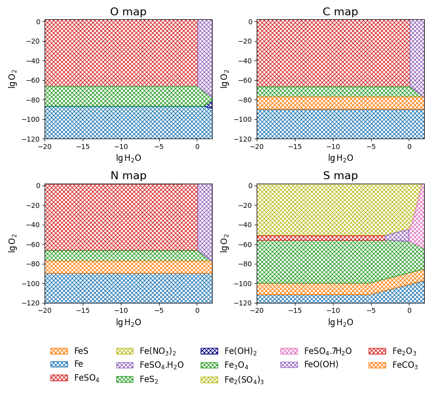

# corrosion_maps
A small Python library for creating and studying corrosion maps of steel in the context of scCO<sub>2</sub> streams.

## How to use as a library
```
#Import
from ccstoolkit import corrosion_maps

#Input
P = {
	'S': 0.5,		#[mol/m^3], [mM]	#Total amount of sulphur (H2S, SOx, ...)
	'N': 0.75,		#[mol/m^3], [mM]	#Total amount of nitrogen (NOx, HNOx, ...)
	'CO2': 2e3,		#[mol/m^3], [mM]	#Activity of CO2								#Optional	#Default is 2000
	'T': 298.15		#[K]				#Temperature									#Optional	#Default is 298.15
}

#Output
print(corrosion_maps.get_stability_maps(P))
```

## How to use the cli
<ins>**Pr**</ins>int the map data

`python3 -m ccstoolkit.corrosion_maps.cli -p 0.5 0.75 2e3 298.15 -pr`

Show the <ins>**pl**</ins>ot

`python3 -m ccstoolkit.corrosion_maps.cli -p 0.5 0.75 2e3 298.15 -pl`

Save the <ins>**o**</ins>utput to file

`python3 -m ccstoolkit.corrosion_maps.cli -p 0.5 0.75 2e3 298.15 -o file_name`

<ins>**S**</ins>ave a pre-formated <ins>**p**</ins>lot to file

`python3 -m ccstoolkit.corrosion_maps.cli -p 0.5 0.75 2e3 298.15 -sp file_name`


## Domain
$S\ \in\ [0.015\ \text{mM},\ 4\ \text{mM}]\ \approx\ [0.8\ \text{ppmx},\ 200\ \text{ppmx}]\ \text{in scCO}_2$

$N\ \in\ [0.015\ \text{mM},\ 4\ \text{mM}]\ \approx\ [0.8\ \text{ppmx},\ 200\ \text{ppmx}]\ \text{in scCO}_2$

$CO_2\ \in\ [0.015\ \text{mM},\ 3000\ \text{mM}]$

$T\ \in\ [223.15\ \text{K},\ 373.15\ \text{K}]$

## Example plot


## License
The software is licensed under the MIT license. You are free to copy, modify, merge, publish, distribute, sublicense, and/or sell
copies of the software. Please, refer to the [full text](../../LICENSE). 
[](../../LICENSE)

