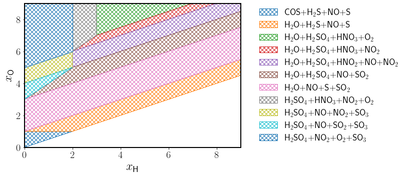
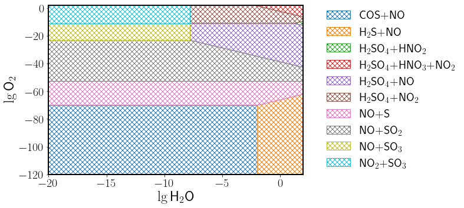

# eqstreamcomp
A small Python library for studying the equilibrium composition of dense CO<sub>2</sub> streams.

## Citation 
If you find this library useful in your research, please cite the following paper:

R. I. Slavchov, M. H.Iqbal, S. Faraji, D. Madden, J. Sonke, S. M. Clarke (2024). Corrosion maps: Stability and composition diagrams for corrosion problems in CO2 transport. *Corrosion Science, 236*, 112204.
[](https://doi.org/10.1016/j.corsci.2024.112204)

## How to use the library
```
#Import
from ccstoolkit import eqstreamcomp

#--------------------------Get the equilibrium composition
c0 = {
	'H': 1,					#[mol/m^3], [mM]	#Total amount of hydrogen (H2O, H2S, ...) 
	'N': 1,					#[mol/m^3], [mM]	#Total amount of nitrogen (NOx, HNOx, ...)  
	'O': 1,					#[mol/m^3], [mM]	#Total amount of oxygen (H2O, NOx, ...)  
	'S': 1, 				#[mol/m^3], [mM]	#Total amount of sulphur (H2S, SOx, ...) 
	'CO2': 2e3,				#[mol/m^3], [mM]	#Activity of CO2								#Optional	#Default is 2000
	'T': 298.15				#[K]				#Temperature									#Optional	#Default is 298.15
}

print(eqstreamcomp.get_composition(c0))

p0 = {
	'H2O': 10,				#[ppmx]
	'H2S': 10,				#[ppmx]  
	'NO2': 10, 				#[ppmx]
	'O2': 10,				#[ppmx]
	'SO2': 10,				#[ppmx] 
	'CO2': 2e3,				#[mol/m^3], [mM]	#Activity of CO2								#Optional	#Default is 2000
	'tot': 18.55e3,			#[mol/m^3], [mM]	#Concentration of all species ~ density of CO2	#Optional	#Default is 18.55e3
	'T': 298.15				#[K]				#Temperature									#Optional	#Default is 298.15
}

print(eqstreamcomp.get_composition(p0))

#--------------------------Get the nodes of the stream stoichiometry map
P = {
	'N/S': 1,				#[-]				#Ratio of the concentrations of nitrogen and sulphur
}

print(eqstreamcomp.get_stoichiometry_map(P))

#--------------------------Get the nodes of the stream stability map
P = {
	'S': 0.5,				#[mol/m^3], [mM]	#Total amount of sulphur (H2S, SOx, ...)
	'N': 0.75,				#[mol/m^3], [mM]	#Total amount of nitrogen (NOx, HNOx, ...)
	'CO2': 2e3,				#[mol/m^3], [mM]	#Activity of CO2								#Optional	#Default is 2000
	'T': 298.15				#[K]				#Temperature									#Optional	#Default is 298.15
}

print(eqstreamcomp.get_stability_map(P))
```

## Domain
$H\ \in\ [0.015\ \text{mM},\ 12\ \text{mM}]\ \approx\ [0.8\ \text{ppmx},\ 650\ \text{ppmx}]\ \text{in scCO}_2$

$N\ \in\ [0.015\ \text{mM},\ 4\ \text{mM}]\ \approx\ [0.8\ \text{ppmx},\ 200\ \text{ppmx}]\ \text{in scCO}_2$

$O\ \in\ [0.015\ \text{mM},\ 24\ \text{mM}]\ \approx\ [0.8\ \text{ppmx},\ 1300\ \text{ppmx}]\ \text{in scCO}_2$

$S\ \in\ [0.015\ \text{mM},\ 4\ \text{mM}]\ \approx\ [0.8\ \text{ppmx},\ 200\ \text{ppmx}]\ \text{in scCO}_2$

<br />

$H_2O\ \in\ [1\ \text{ppmx},\ 200\ \text{ppmx}]\ \text{in scCO}_2\ \approx\ [0.018\ \text{mM},\ 4\ \text{mM}]$

$H_2S\ \in\ [1\ \text{ppmx},\ 100\ \text{ppmx}]\ \text{in scCO}_2\ \approx\ [0.018\ \text{mM},\ 2\ \text{mM}]$

$NO_2\ \in\ [1\ \text{ppmx},\ 200\ \text{ppmx}]\ \text{in scCO}_2\ \approx\ [0.018\ \text{mM},\ 4\ \text{mM}]$

$O_2\ \in\ [1\ \text{ppmx},\ 200\ \text{ppmx}]\ \text{in scCO}_2\ \approx\ [0.018\ \text{mM},\ 4\ \text{mM}]$

$SO_2\ \in\ [1\ \text{ppmx},\ 100\ \text{ppmx}]\ \text{in scCO}_2\ \approx\ [0.018\ \text{mM},\ 2\ \text{mM}]$

<br />

$CO_2\ \in\ [0.015\ \text{mM},\ 3000\ \text{mM}]$

$tot\ \in\ [1e3\ \text{mM},\ \infty\ \text{mM}]$

$T\ \in\ [223.15\ \text{K},\ 373.15\ \text{K}]$

## Example plot
 

## License
The software is licensed under the MIT license. You are free to copy, modify, merge, publish, distribute, sublicense, and/or sell
copies of the software. Please, refer to the [full text](../../LICENSE). 
[](../../LICENSE)
